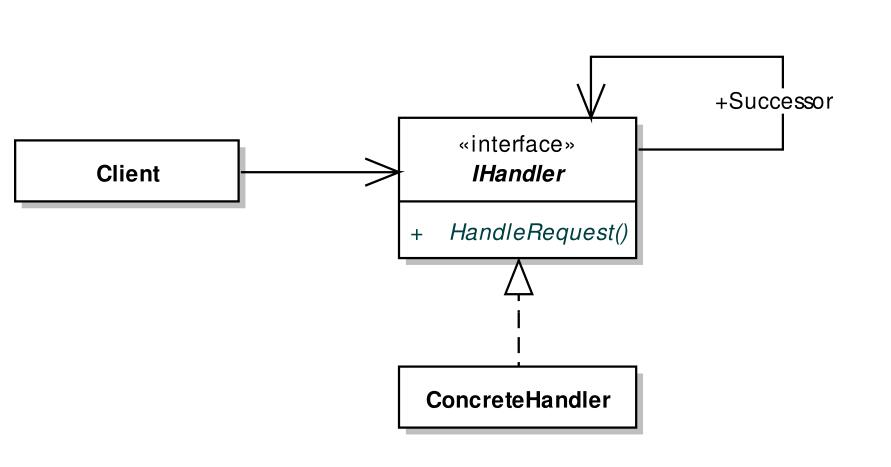

# 职责链模式
- #### Avoid coupling the sender of a request to its receiver by giving more than one object a change to handle the request.Chain the receiving objects and pass the request along the chain until an object handles it.
- #### 职责链模式(Chain of Responsibility,CoR)用于对目标对象施与一系列操作,为了避免调用者与这"一系列"操作对象(Handler)产生直接耦合关系,可以把这些操作抽象,然后组织为一个链表,在遍历这个链表的过程中找到适合的操作对象对目标对象进行操作。
- #### 经典职责链模式的静态结构

- #### 经典职责链模式一般用一个单链表组织所有操作对象(Handler),其中每个操作对象还包括一个指向其后续节点的引用,而客户程序所依赖的也只是一个抽象的IHandler类型。
- #### Cor模式的实质是通过一个"入口"接触客户程序与多个操作间的耦合关系,并别借助链表的动态性能力,为有效编排这个"入口"后的一组操作提供可能。
- #### CoR模式广泛引用于架构模式、大型项目的基础平台及SOA环境下的企业服务总线(Enterprise Service Bus,ESB),其交互过程中往往涉及分布式事务性链式操作,而不像示例中仅仅是内存对象,消息队列、数据库、外部服务及云计算环境都可以针对一个Request内容用"链式"方法连接。