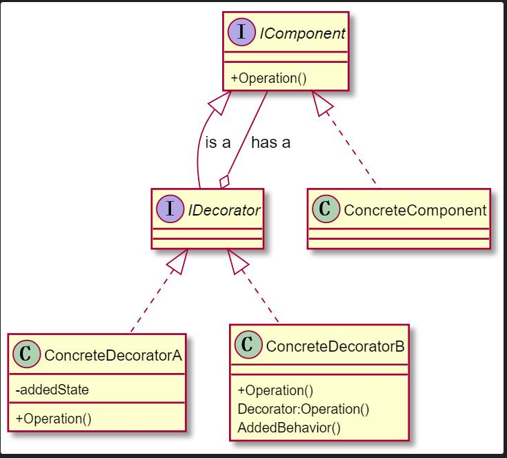
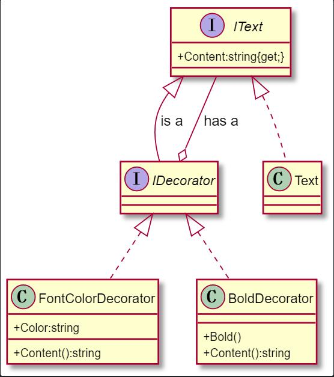

# 装饰模式
- ## Attach additional responsibilities to an object dynamically.Decorators provide a flexible alternative to subclassing for extending functionality
- ## 装饰模式的意图非常明确:动态为对象增加新的职责。
- ## 经典装饰模式的静态结构,如下图

- ## Notepad应用装饰模式后的静态结构,如下图
