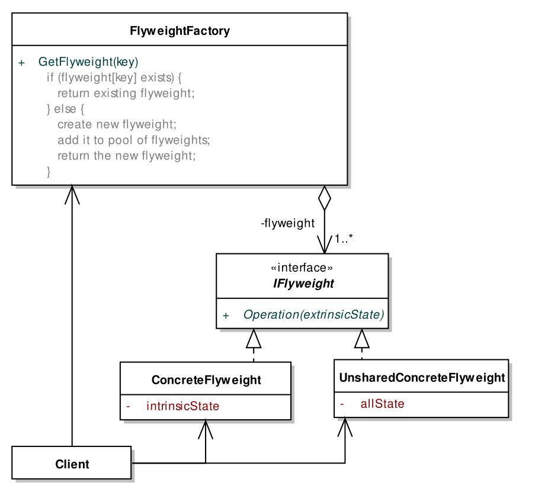

# 1. 享元模式
- #### 享元模式的意图是通过共享支持大量细颗粒度对象
- 衡量标准
    - 该类型的对象实例众多。
    - 众多实例可以归为数量相对小得多的种类。
- #### 经典享元模式的静态结构

- #### 为了更好的封装享元机制,实际项目中,有关享元对象的分类可以对外屏蔽。
- #### 享元模式的主旨在于通过共享节省总体资源占用,不过共享将导致资源访问上的一系列问题,一个更有效的使用准则就是"尽量晚地开始使用,尽量早地释放"。