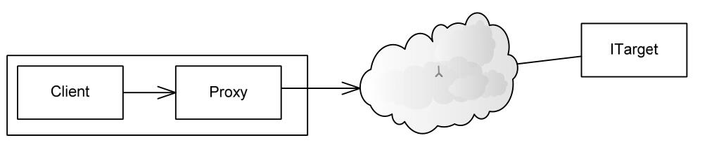
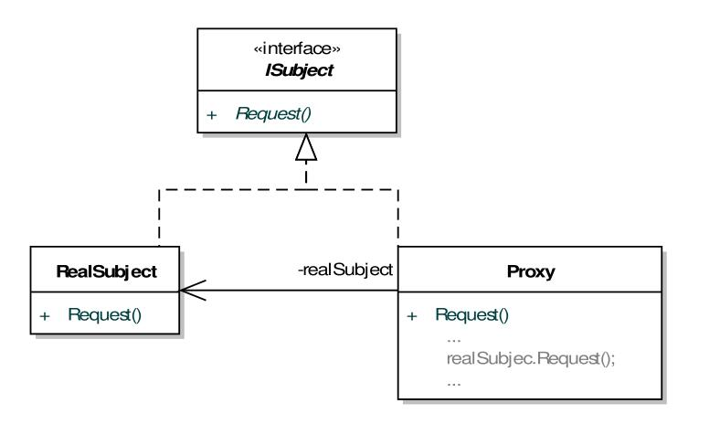

# 代理模式
- #### 代理模式复杂性的关键在于运行环境的复杂性
    - ##### 网络访问。
    - ##### 数据库访问。
    - ##### 各种透明的安全控制。
    - ##### 负载均衡的设计。
    - ##### 随着Web Service的普及,如何适应整个互联网服务环境下的需要。
    - ##### 面向大计算量的虚拟代理。
- #### 代理的目的就是要把这些复杂性封装起来，让客户程序更容易使用藏在它身后的那些对象。
- #### 基于代理的远程方式示意图

- #### 代理对象的设计应注意如下要点:
    - ##### 引入代理对象不应该增加客户程序访问的复杂性。
    - ##### 代理的目的是控制客户程序对目标对象的访问,因此代理类型必须可以直接或间接地知道目标类型在哪,以及如何访问。
    - ##### 代理类不必知道具体的目标类型,很多时候它只要能够按照与客户程序的约定,提供一个具有抽象特征类型即可,至于具体目标类型,可以由创建者模式来实现。
- #### 静态代理模式的静态结构

- #### 外观模式是屏蔽复杂性的,很多时候代理模式的控制本身也就是对各种复杂性的屏蔽,只不过外观处理的是一个逻辑上的"子系统",而且其封装后的结果并没有具体抽象接口的要求,但在代理模式中客户程序需要的接口事先是明确的。外观模式往往会生成一个更易于使用的新接口,而代理模式保持接口一致。
- #### 根据应用的通信要求,可分为:
    - #### 本地代理
        - #### 本地并非物理位置上的本地,而是指当前进程内部
    - #### 远程代理
        - #### 远程也并非仅仅是物理位置上的远程,同一台机器上的不同进程间仍然可以视为远程。
- #### 作为一个很具工程意义的模式,代理模式既以设计模式出现,同时也是很重要的架构模式。