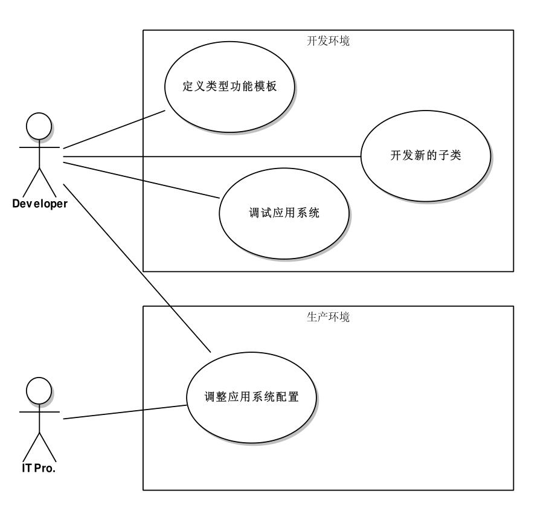
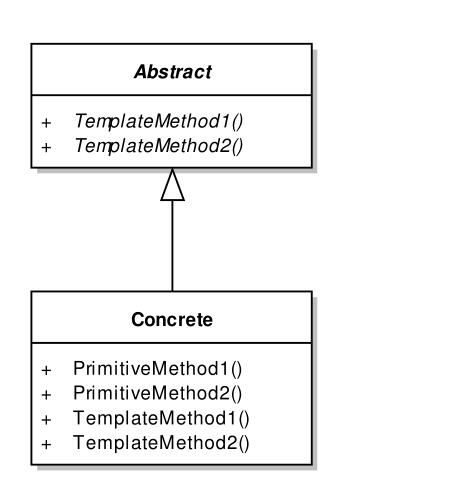

# 模板方法模式
- #### Define the skeleton of an algorithm in an operation,deferring some steps to subclasses.Template Method lets subclasses redefine certain steps of an algorithm without changing the algorithm's structure.
- #### 模板方法模式是GOF的23个模式中最朴实的一个模式,它体现出面向对象设计中继承和多态的基本特征。
- #### 通过配置文件定义模板子类后开发人员和系统管理人员的工作分工

- #### 模板方法模式的静态结构

- #### 经典模板方法模式只是对面向对象的朴实延伸,但随着开发语言和开发习惯的发展,我们在通过"Subclasses"继承之外有了更多的选择,我们可以用委托作为方法的模板,用泛型作为类,接口的模板,用配置作为系统架构的模板